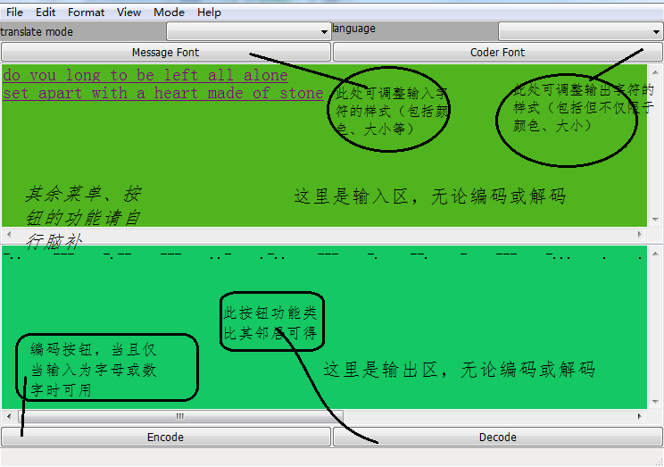

# **Morse**

0. 本软件是一个带GUI的“摩斯密码”的转换器，实现摩斯密码的编码和解码功能。

1. 程序界面分别用wxPython和kivy实现，morse.kv和morse_kv.py为用kivy实现
   的版本；morse.py为用wxPython实现的版本。
   界面分别如下：
   
   
   
kivy版本界面；

   
   
wxPython版本界面。

2. morse-win32.msi是可以独立运行于windows系统的可执行程序。
   直接双击安装文件morse-win32.msi，即可运行安装程序。

选择安装路径，按提示点击next,最后点击finish即可完成安装。

安装程序不会自动在桌面和开始菜单建立快捷方式，找到安装时设置的安装路径，
双击morse.exe,启动程序。

3. 界面中各按钮功能如下：
Encode（编码）按钮：将输入的英文字符和数字编码为摩斯密码在下方输出区输出。
Decode（解码）按钮：将输入的摩斯密码解码为英文字符和数字在下方输出区输出。
Message Font按钮：设置输入字符的字体大小、样式、颜色等。
Coder Font按钮：设置输出字符的字体大小、样式、颜色等。

4. 本软件不支持对中文的编码，事实上，本软件不支持对任何非英文字符和数字
进行编码，输入中文字符进行编码可能会导致软件崩溃。

## Todo:
增加对输入文档的支持。
完善输入区的字符处理。

## Feedback:
有任何疑问或建议欢迎[反馈](https://github.com/WellenWoo/morse)。

